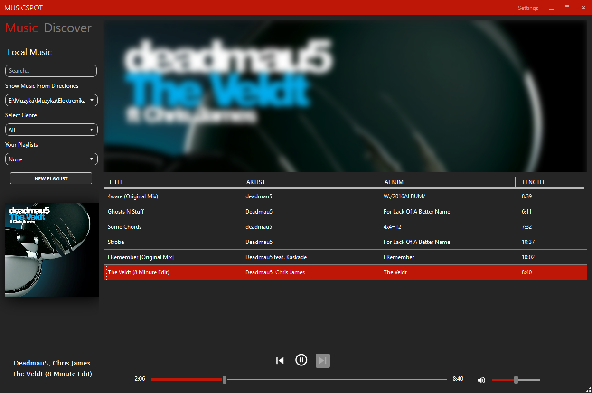

# MusicSpot
Modern media player with music APIs integration. Based on Spotify style with focus on local files.

Written in C# with WPF and NET Framework 4.7

Graphic library used: Mahapps Metro: https://github.com/MahApps/MahApps.Metro

Integration with Spotify thanks to SpotifyAPI by JohnnyCrazy: https://github.com/JohnnyCrazy/SpotifyAPI-NET

## Overview
MusicSpot is a local music player integrated with some music sites delivering user a convenient way to browse and listen local music files with displaying various metadata about music, lyrics and so on.




### Usage
You can generate installer with a Setup project included in repository from Visual Studio and run application normally by building the Setup and then clicking <i> install </i>.

You can also build the solution by installing the necessary libraries in nuget package manager and run it inside IDE

```c#
Update-Package
```


